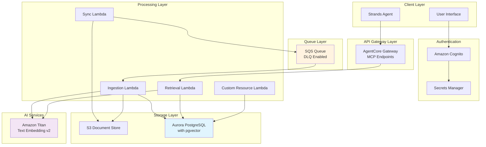

# Design Document: Aurora Vector Knowledge Base

## Overview

This document outlines the design for a custom knowledge base system built on Amazon RDS Aurora PostgreSQL with pgvector extension. The system provides multi-vector storage capabilities, automated document ingestion from S3, intelligent retrieval functionality, and secure access through JWT authentication. The architecture supports scalable document processing through SQS-based queuing and exposes retrieval capabilities through Amazon Bedrock AgentCore Gateway as MCP endpoints.

## Architecture

### High-Level Architecture



### Network Architecture

The system will be deployed within a VPC with the following network configuration:

- **Private Subnets**: Aurora Serverless v2 cluster deployed across multiple AZs
- **Public Subnets**: NAT Gateways for Lambda internet access
- **Lambda Subnets**: Private subnets for Lambda functions with VPC endpoints
- **Security Groups**: Restrictive rules allowing only necessary communication
- **Serverless Benefits**: Automatic scaling eliminates need for instance size planning

## Components and Interfaces

### 1. Aurora PostgreSQL Serverless v2 Database

**Configuration:**
- Engine: PostgreSQL 15.13+ with pgvector extension v0.5.0+
- Deployment: Aurora Serverless v2 for automatic scaling and cost optimization
- Scaling Range: 0.5 to 16 Aurora Capacity Units (ACU)
  - Minimum: 0.5 ACU (~1GB RAM, 2 vCPUs) for cost efficiency during low usage
  - Maximum: 16 ACU (~32GB RAM, 16 vCPUs) for handling peak vector operations
- Multi-AZ deployment for high availability
- Automated backups with 7-day retention
- Auto-pause: Disabled (to maintain connection availability for Lambda functions)

**Serverless v2 Benefits:**
- **Cost Optimization**: Pay only for actual compute usage, scales down to 0.5 ACU during idle periods
- **Automatic Scaling**: Seamlessly handles variable workloads from document ingestion spikes to search queries
- **No Instance Management**: Eliminates need to provision and manage specific instance types
- **Sub-second Scaling**: Rapid response to workload changes without connection drops
- **Performance**: Maintains same performance characteristics as provisioned Aurora instances

**Schema Design:**

```sql
CREATE TABLE vector_store (
    id UUID PRIMARY KEY DEFAULT gen_random_uuid(),
    document TEXT NOT NULL,
    embedding_document VECTOR(1024) NOT NULL,
    metadata JSONB NOT NULL,
    embedding_metadata VECTOR(512) NOT NULL,
    provider TEXT NOT NULL,
    embedding_provider VECTOR(256) NOT NULL,
    category TEXT NOT NULL,
    embedding_category VECTOR(256) NOT NULL,
    type TEXT NOT NULL,
    embedding_type VECTOR(256) NOT NULL,
    source_s3_uri TEXT NOT NULL,
    created_at TIMESTAMP WITH TIME ZONE DEFAULT NOW(),
    updated_at TIMESTAMP WITH TIME ZONE DEFAULT NOW()
);

-- Indexes for vector similarity search
CREATE INDEX idx_vector_store_embedding_document ON vector_store 
USING hnsw (embedding_document vector_cosine_ops);

CREATE INDEX idx_vector_store_embedding_metadata ON vector_store 
USING hnsw (embedding_metadata vector_cosine_ops);

CREATE INDEX idx_vector_store_embedding_provider ON vector_store 
USING hnsw (embedding_provider vector_cosine_ops);

CREATE INDEX idx_vector_store_embedding_category ON vector_store 
USING hnsw (embedding_category vector_cosine_ops);

CREATE INDEX idx_vector_store_embedding_type ON vector_store 
USING hnsw (embedding_type vector_cosine_ops);

-- Indexes for filtering
CREATE INDEX idx_vector_store_provider ON vector_store (provider);
CREATE INDEX idx_vector_store_category ON vector_store (category);
CREATE INDEX idx_vector_store_type ON vector_store (type);
CREATE INDEX idx_vector_store_source_s3_uri ON vector_store (source_s3_uri);
```

### 2. Lambda Functions

#### Custom Resource Lambda
**Purpose:** Database initialization during CDK deployment
**Runtime:** Python 3.11
**Memory:** 512 MB
**Timeout:** 5 minutes

**Responsibilities:**
- Create pgvector extension
- Create vector_store table with proper schema
- Create all necessary indexes
- Handle CloudFormation custom resource lifecycle

#### Sync Lambda
**Purpose:** S3 directory synchronization and job queuing
**Runtime:** Python 3.11
**Memory:** 1024 MB
**Timeout:** 15 minutes

**Input Interface:**
```json
{
  "s3_bucket": "string",
  "s3_prefix": "string",
  "jwt_token": "string"
}
```

**Output Interface:**
```json
{
  "status": "success|error",
  "files_queued": "number",
  "message": "string"
}
```

#### Ingestion Lambda
**Purpose:** Document processing and vector storage
**Runtime:** Python 3.11
**Memory:** 2048 MB
**Timeout:** 15 minutes
**Concurrency:** Maximum 10 concurrent executions

**SQS Message Interface:**
```json
{
  "s3_uri": "s3://bucket/path/to/document.txt",
  "jwt_token": "string"
}
```

**Processing Flow:**
1. Validate JWT token
2. Download document from S3
3. Extract and derive metadata (provider, category, type)
4. Implement fixed chunking strategy (500 tokens, 10% overlap)
5. Generate embeddings for each chunk and metadata using Titan v2
6. Delete existing records with same S3 URI
7. Store all chunks and embeddings in database

#### Retrieval Lambda
**Purpose:** Vector similarity search and document retrieval
**Runtime:** Python 3.11
**Memory:** 1024 MB
**Timeout:** 30 seconds

**Input Interface:**
```json
{
  "query": "string",
  "embedding_types": ["document", "metadata", "provider", "category", "type"],
  "similarity_threshold": "float (0.0-1.0)",
  "max_results": "integer",
  "filters": {
    "provider": "string (optional)",
    "category": "string (optional)",
    "type": "string (optional)"
  },
  "jwt_token": "string"
}
```

**Output Interface:**
```json
{
  "results": [
    {
      "id": "uuid",
      "document": "string",
      "metadata": "object",
      "provider": "string",
      "category": "string",
      "type": "string",
      "source_s3_uri": "string",
      "similarity_score": "float",
      "embedding_type_matched": "string"
    }
  ],
  "total_results": "integer"
}
```

### 3. SQS Queue Configuration

**Main Queue:**
- Visibility Timeout: 15 minutes (matches Lambda timeout)
- Message Retention: 14 days
- Receive Count: 3 attempts before DLQ

**Dead Letter Queue:**
- Message Retention: 14 days
- CloudWatch alarms for monitoring failed messages

### 4. Authentication and Security

#### Amazon Cognito Configuration
- User Pool with email/password authentication
- App Client with JWT token generation
- Token expiration: 1 hour (configurable)
- Refresh token expiration: 30 days

#### Secrets Manager Integration
- Store Cognito client secrets
- Automatic rotation enabled
- Cross-service access policies

#### JWT Validation Flow
```python
def validate_jwt_token(token: str) -> dict:
    """
    Validates JWT token against Cognito User Pool
    Returns user claims if valid, raises exception if invalid
    """
    # Implementation details in Lambda functions
```

### 5. AgentCore Gateway Integration

**MCP Endpoint Configuration:**
- Base URL: `/mcp/knowledge-base/`
- Authentication: Bearer JWT tokens
- Rate limiting: 100 requests/minute per user

**Exposed Methods:**
- `search_documents`: Vector similarity search
- `get_document`: Retrieve specific document by ID
- `list_providers`: Get available providers
- `list_categories`: Get available categories
- `list_types`: Get available document types

## Data Models

### Document Chunking Strategy

**Fixed Chunking Implementation:**
- Maximum chunk size: 500 tokens
- Overlap percentage: 10% (50 tokens)
- Tokenization: Using tiktoken for consistent token counting
- Chunk boundary: Respect sentence boundaries when possible

### Metadata Extraction

**Automated Metadata Derivation:**
```python
def extract_metadata(document_content: str, s3_uri: str) -> dict:
    """
    Extract metadata from document content and S3 path
    
    Returns:
    {
        "provider": "company_name",  # Derived from content analysis
        "category": ["topic1", "topic2"],  # Main topics identified
        "type": "news|announcement|technical_doc|blog",  # Content classification
        "source_file": "filename.ext",
        "file_size": "bytes",
        "processed_at": "timestamp"
    }
    """
```

### Embedding Generation Strategy

**Multi-Vector Approach:**
1. **Document Embeddings (1024d)**: Generated from each text chunk
2. **Metadata Embeddings (512d)**: Generated from consolidated metadata JSON
3. **Provider Embeddings (256d)**: Generated from provider name
4. **Category Embeddings (256d)**: Generated from category list
5. **Type Embeddings (256d)**: Generated from document type

## Error Handling

### Lambda Error Handling
- Structured logging with correlation IDs
- Exponential backoff for retryable errors
- Dead letter queue for persistent failures
- CloudWatch alarms for error rate monitoring

### Database Error Handling
- Connection pooling with retry logic
- Transaction rollback on failures
- Constraint violation handling
- Performance monitoring and alerting

### Authentication Error Handling
- JWT expiration handling with refresh token flow
- Invalid token responses (HTTP 401)
- Rate limiting responses (HTTP 429)
- Service unavailable responses (HTTP 503)

## Testing Strategy

### Unit Testing
- Lambda function business logic testing
- Database query testing with test fixtures
- JWT validation testing
- Embedding generation testing

### Integration Testing
- End-to-end document ingestion flow
- Vector similarity search accuracy
- Authentication flow testing
- SQS message processing testing

### Performance Testing
- Concurrent ingestion load testing
- Vector search performance benchmarking
- Database connection pool testing
- Memory usage optimization

### Security Testing
- JWT token validation testing
- SQL injection prevention testing
- Access control verification
- Secrets management testing

## Deployment Considerations

### CDK Stack Structure
```
aurora-vector-knowledge-base-stack/
├── networking/
│   ├── vpc_construct.py
│   └── security_groups.py
├── database/
│   ├── aurora_cluster.py
│   └── custom_resource_lambda.py
├── processing/
│   ├── sync_lambda.py
│   ├── ingestion_lambda.py
│   └── retrieval_lambda.py
├── authentication/
│   ├── cognito_construct.py
│   └── secrets_manager.py
├── messaging/
│   └── sqs_construct.py
└── gateway/
    └── agentcore_integration.py
```

### Environment Configuration
- Development: Single AZ, 0.5-4 ACU scaling range for cost optimization
- Staging: Multi-AZ, 0.5-8 ACU scaling range, production-like configuration
- Production: Multi-AZ, 0.5-16 ACU scaling range, optimized for performance and automatic cost management

### Monitoring and Observability
- CloudWatch dashboards for system metrics
- X-Ray tracing for distributed request tracking
- Custom metrics for business logic monitoring
- Automated alerting for system health

This design provides a robust, scalable foundation for the multi-vector knowledge base system while maintaining security, performance, and operational excellence standards.