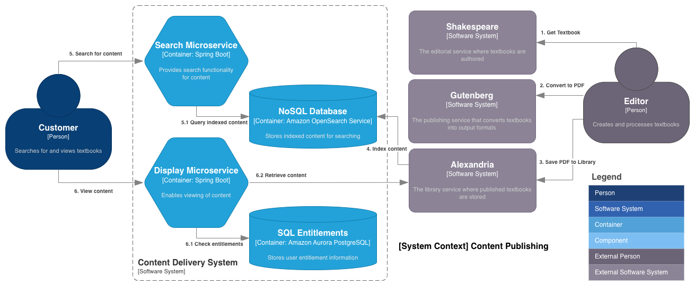
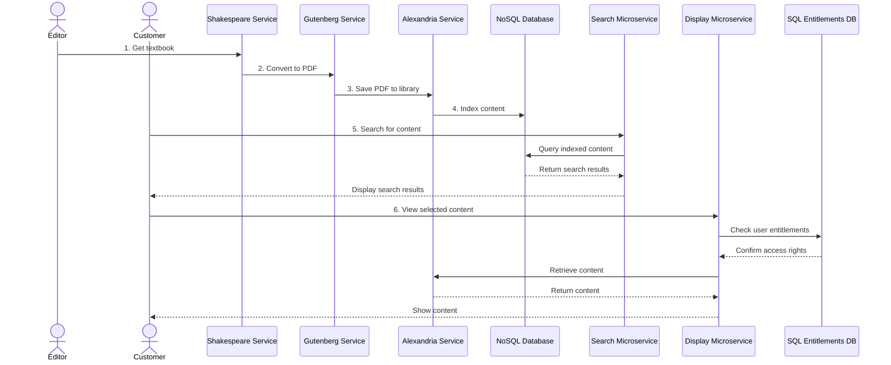

# Content Publishing System Architecture

## Key Components and Services

The architecture of the content publishing system includes the following key components:

### Actors

- **Customer**: End users who search for and view textbooks
- **Editor**: Content creators who author textbooks and convert them to PDF format

### Internal Services

Based on the internal service descriptions:

- **Shakespeare**: The editorial service where textbooks are authored by editors
- **Gutenberg**: The publishing service that converts textbooks into output formats like PDF or ePub
- **Alexandria**: The library service where published textbooks are stored

### Microservices

- **Search Microservice**: Handles customer search requests and interfaces with the NoSQL database
- **Display Microservice**: Manages the presentation layer for customers to view content

### Data Storage

- **NoSQL Database**: Stores search indexes and metadata for quick retrieval
- **SQL Database (Entitlements)**: Manages user entitlements and access permissions

## Data Flow Description

The system operates through the following numbered sequence:

1. **Get Textbook** (1): Editor retrieves textbook content from Shakespeare service for editing
2. **Convert to PDF** (2): Editor converts the textbook content to PDF format using Gutenberg service  
3. **Save PDF to Library** (3): The converted PDF is stored in Alexandria library service
4. **Index** (4): Content metadata and search information is indexed in the NoSQL database
5. **Search** (5): Customer performs search queries through the Search Microservice
6. **View** (6): Customer views search results and content through the Display Microservice

The Display Microservice also connects to the SQL Entitlements database to verify user access permissions.

## Sequence Diagram

## AWS Services Recommendations for Databases

Two database systems are needed: a NoSQL database for search functionality and a SQL database for entitlements. Here are recommendations for each:

### NoSQL Database: Amazon OpenSearch Service (formerly Amazon Elasticsearch)

For the NoSQL database that powers the search functionality, Amazon OpenSearch Service would be the best choice because:

1. **Advanced Search Capabilities**: OpenSearch is purpose-built for full-text search with features like:
   - Text analysis with language-specific tokenization and stemming
   - Relevance scoring and ranking
   - Support for complex queries including fuzzy matching, phrase matching, and proximity searches
   - Faceted search for filtering results

2. **Scalability**: Easily scales to accommodate large volumes of textbook content with automatic node provisioning.

3. **Performance**: Designed for fast search results with optimized indexing and query processing.

4. **Integration**: Seamlessly integrates with other AWS services that might be part of the expanded architecture.

5. **Vector Search**: Supports semantic search capabilities through vector embeddings, enabling more intelligent content discovery beyond keyword matching.

Amazon OpenSearch Service also provides managed administration, reducing operational overhead, and includes features like fine-grained access control, automated snapshots, and encryption at rest and in transit.

### SQL Database: Amazon RDS for MySQL or PostgreSQL

For the entitlements database, Amazon RDS would be appropriate because:

1. **Relational Structure**: Entitlements typically involve relationships between users, content, and permission levels, which align well with relational database capabilities.

2. **ACID Compliance**: Ensures reliable transaction processing for critical access control operations.

3. **Query Flexibility**: Supports complex SQL queries needed for determining access rights and entitlements.

4. **Security Features**: Offers robust security controls including encryption, network isolation, and IAM integration.

Either MySQL or PostgreSQL would be suitable depending on specific requirements and team expertise, with both offering strong performance and reliability for managing user entitlements.
